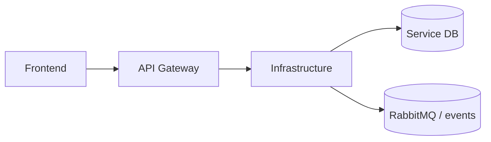

# Software Architecture

## Responsibility

Local compose stack, gateway wiring, service integration verification, functional smoke tests, deployment URL/runbook, monitoring evidence, and cross-service operational docs.

## Integration Surface

Gateway exposes `/api/**` and websocket routes to auth, catalogue, auction, wallet, order-notification, and frontend static hosting integration.

## Platform Position

## State and Consistency

Infrastructure does not own domain state; it wires databases, RabbitMQ, services, gateway, and observability endpoints.

## Cross-Service Contract

The gateway and event bus are the only supported cross-service entry points. Downstream consumers must tolerate additive optional fields, while existing required fields and routing keys remain stable.
