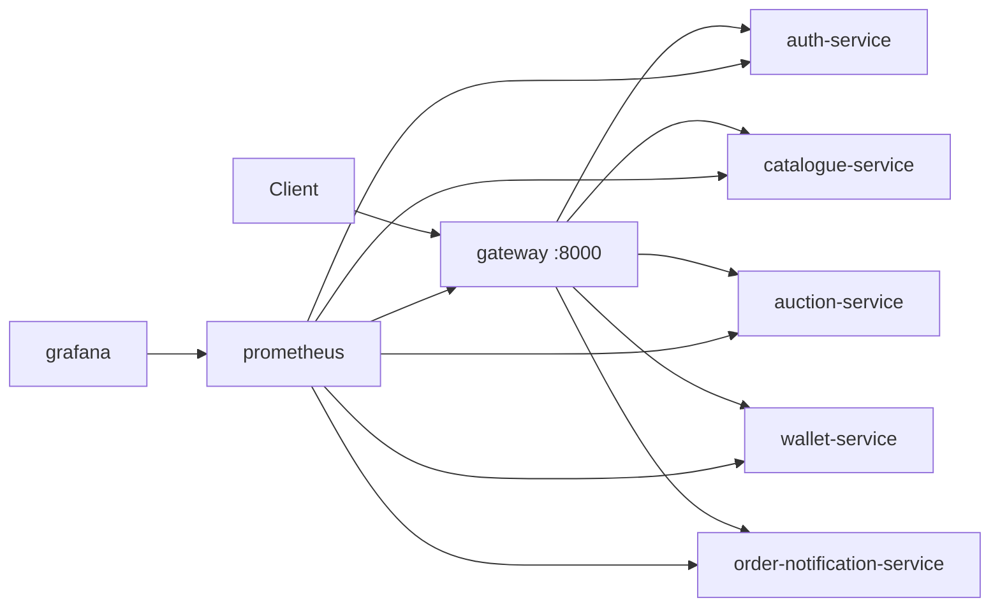

# Software Architecture

## System topology (compose)

| Service | Internal port | Role |
|---------|---------------|------|
| `gateway` | 8000 | North-south API + WS proxy |
| `auth-service` | 8080 | Identity |
| `catalogue-service` | 8081 (+ gRPC 9091) | Listings |
| `auction-service` | 8082 | Bidding |
| `wallet-service` | 8083 (+ gRPC 50051) | Ledger |
| `order-notification-service` | 8084 | Orders + STOMP |
| `frontend` | 5173 | Vite dev server |
| `prometheus` | 9090 | Metrics |
| `grafana` | 3000 | Dashboards |
| `rabbitmq` | 5672 / 15672 | Events |
| `redis` | 6379 | Auth sessions |

Definition: [`docker-compose.yml`](../docker-compose.yml)

## Gateway architecture

## Event bus

- Exchange: `bidmart.events` (env `BIDMART_EVENTS_EXCHANGE`)
- ADR: [adr/ADR-001-outbox.md](./adr/ADR-001-outbox.md)

## Observability architecture

- Scrape config: [`monitoring/prometheus/prometheus.yml`](../monitoring/prometheus/prometheus.yml)
- Dashboards: [`monitoring/grafana/dashboards/`](../monitoring/grafana/dashboards/) (e.g. `bidmart-auction-service.json`)
- Provisioning: `monitoring/grafana/provisioning/`

## API documentation aggregation

`swagger-ui` service mounts OpenAPI from each module's `docs/openapi.yaml` (see compose volumes).
