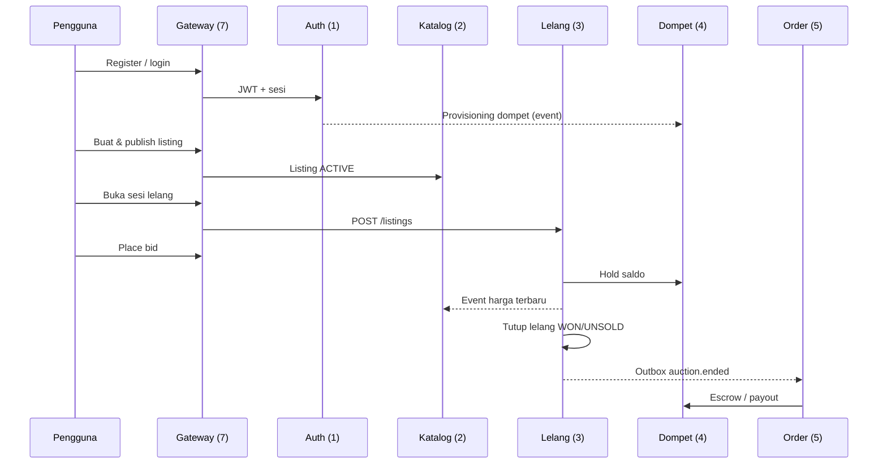

# Alur sistem BidMart

Ringkasan alur inti yang menghubungkan modul 1–5. Setiap langkah merujuk ke spesifikasi modul di `docs/8. Spesifikasi.md` masing-masing repo.

## Langkah

1. **Registrasi & login (modul 1)** — verifikasi email, JWT access/refresh, RBAC, opsional 2FA/OAuth.
2. **Dompet (modul 4)** — wallet dibuat via event registrasi; top-up Midtrans sandbox.
3. **Listing (modul 2)** — seller membuat listing `DRAFT`, publish → `ACTIVE` dengan `endTime`, reserve, increment.
4. **Sesi lelang (modul 3)** — `POST /api/v1/listings` membuka sesi penawaran untuk `listingId`.
5. **Bid (modul 3)** — validasi aturan, hold dompet, anti-sniping; katalog memperbarui `currentPrice` via event.
6. **Penutupan (modul 3)** — `WON` / `UNSOLD`, release/convert hold, outbox ke katalog & order.
7. **Pasca-lelang (modul 5, opsional)** — order dari `auction-won`, notifikasi REST/STOMP, escrow payout setelah konfirmasi buyer.

## Prinsip arsitektur

- Tidak ada database bersama antar modul.
- Validasi blocking: HTTP sinkron (lelang ↔ katalog/dompet).
- Pembaruan non-kritis: RabbitMQ (`bidmart.events`).
- Satu identitas pengguna dari gateway (`X-User-Id`).
