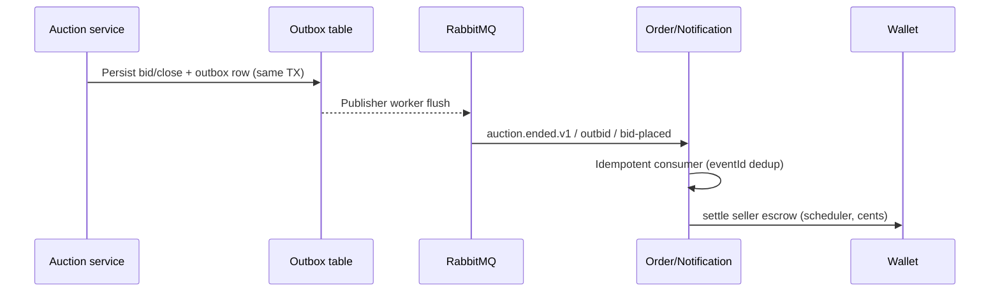

# Software Design — Before / After (One Page)

Tanggal: 2026-05-21  
Fokus: **Transactional Outbox** (auction → order/notifications) dan **Escrow settlement** (wallet → order payout).  
Tujuan rubrik: Software Design skala 4 dengan perbandingan desain terukur.

## 1. Problem (before)

| Area | Before behavior | Risk |
|------|-----------------|------|
| Auction close → downstream | HTTP callback langsung ke order/wallet saat close; gagal network = state `WON` tanpa order atau escrow | Split brain, manual repair |
| Payout on confirm | Order scheduler mengirim jumlah tanpa kontrak cents/dollars konsisten | Seller payout salah (100×) |
| Notifications | Poll atau inline call dari auction thread | Coupling, latency pada hot path bid |

## 2. After (current design)

### 2.1 Transactional outbox (auction)

- **Pattern:** Transactional Outbox + at-least-once delivery.
- **Before:** Best-effort HTTP ke peer services dari request path.
- **After:** Event ditulis ke outbox dalam transaksi yang sama dengan perubahan auction; worker mempublish ke `auction.*.v1`; catalogue dan order mengonsumsi dengan dedup `eventId`.
- **Measurable impact:** Close path tidak menunggu HTTP peer; retry aman; integrasi catalogue/order decoupled.

### 2.2 Escrow settlement (wallet + order)

- **Pattern:** Saga-style compensation di auction (release hold) + **scheduled settlement** di order.
- **Before:** Payout langsung di handler confirm tanpa normalisasi mata uang.
- **After:** Buyer confirm → order `CONFIRMED` → `OrderPayoutScheduler` memanggil wallet `payoutSeller(sellerId, amountCents, orderId)` setelah grace period; `toCents(BigDecimal)` memakai skala 2 (dollar → cents).
- **Measurable impact:** Payout integration test memverifikasi 125.00 → 12500 cents; financial P0-2 tertutup.

## 3. SOLID mapping (ringkas)

| Principle | Outbox | Escrow settlement |
|-----------|--------|-------------------|
| SRP | Publisher worker hanya flush outbox | Scheduler hanya release payout confirmed orders |
| OCP | Event type baru = binding Rabbit baru, consumer switch | Wallet client interface, implementasi HTTP/gRPC |
| DIP | Order consumer bergantung pada `OrderService` / `WalletClient` abstraksi, bukan DB auction |

## 4. Before / after comparison table

| Metric | Before | After |
|--------|--------|-------|
| Coupling auction ↔ order | Synchronous HTTP | Async events + idempotent consumer |
| Failure on close | Partial WON without payout path | Outbox retry; consumer dedup |
| Payout correctness | Ambiguous dollar/cents | Explicit `toCents` + contract tests |
| Testability | Integration-only | Unit: `OrderPayoutSchedulerTest`, `AuctionOrderEventConsumerTest` |

## 5. Evidence paths

- Outbox & publishers: `bidmart-auction-service-rust` (outbox worker, `auction_service.rs`).
- Consumer: `bidmart-order-and-notification-service/.../event/AuctionOrderEventConsumer.java`.
- Payout: `OrderPayoutScheduler.java`, tests `OrderPayoutSchedulerTest.java`.
- Coverage gate: JaCoCo report `bidmart-order-and-notification-service/build/reports/jacoco/test/html/index.html` (≥90% line).

## 6. Rubric checklist link

Centang **B1 Software Design** di `FINAL_RUBRIC_CHECKLIST.md` setelah reviewer menyetujui dokumen ini sebagai bukti before-after design improvement.
